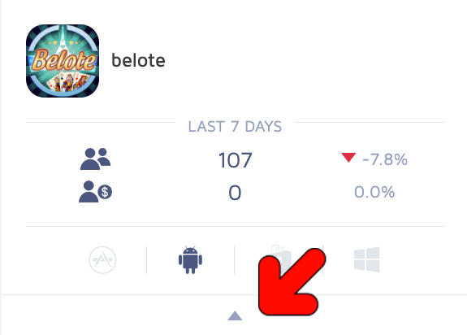
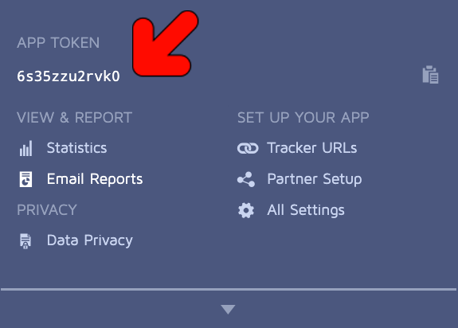

# Adjust
## Configuration
Go to **Assets/Senspark EE-x/Settings** and enable Adjust plugin

## Basic usage
Initialization
```csharp
var appToken = "cmefsp274d1c";
var plugin = PluginManager.CreatePlugin<IAdjust>();
	plugin.Initialize(new AdjustConfig()
		.SetToken(appToken)
		.SetEnvironment(AdjustEnvironment.Production));
```

## Get app token
- Login your senspark account to the website <https://dash.adjust.com>
- Select your app



- Copy app token

