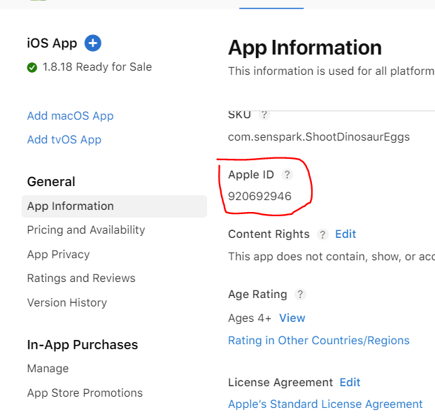

# Appsflyer
## Configuration
Go to **Assets/Senspark EE-x/Settings** and enable Appsflyer plugin

## Basic usage
Initialization
```csharp
var plugin = PluginManager.CreatePlugin<IAppsFlyer>();
plugin.Initialize("dev key", "ios app id");
plugin.StartTracking();
```

## Get dev key and ios app id
- Dev key: contact Mr.Hai
- iOS app id:

