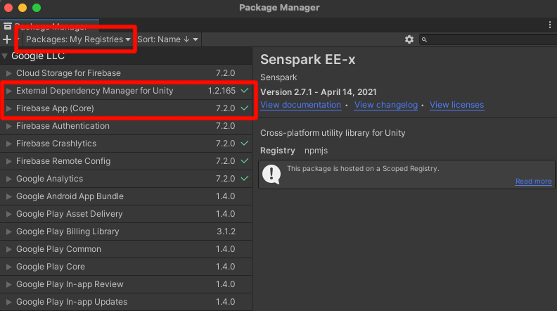

# Firebase
## Requirements
- Install **External Dependency Manager for Unity** and **Firebase App (Core)** package in **My Registries** packages


- Follow step 2,3,4 of [document](https://firebase.google.com/docs/unity/setup?hl=fi#register-app) to create and add **Firebase Configuration Files** to project.

## Initialization
```csharp
public async Task Initialize() {
	await FirebaseApp.CheckAndFixDependenciesAsync().ContinueWith(task => {
		var dependencyStatus = task.Result;
		if (dependencyStatus == DependencyStatus.Available) {
			// success
		} else {
			// error
		}
	});
}
```

## Services
### Firebase Crashlytics
- Installation: Install the package name **Firebase Crashlytics**

### Firebase Analytics (google analytics)
- Installation: Install the package name **Google Analytics**
- Basic usage: [Link](https://firebase.google.com/docs/analytics/unity/start?hl=fi#log_events)

### Firebase Remote Config
- Installation: Install the package name **Firebase Remote Config)**
- Basic usage: [Link](https://firebase.google.com/docs/remote-config/get-started?hl=fi&platform=unity#set_in-app_default_parameter_values)

### Firebase Clound Storage
- Installation: Install the package name **Clound Storage for Firebase**
- Basic usage: [Link](https://firebase.google.com/docs/storage/unity/start#create-default-bucket)