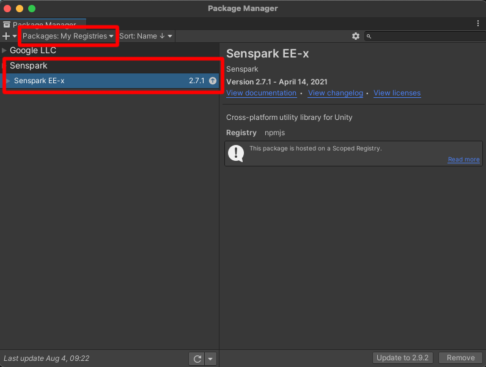
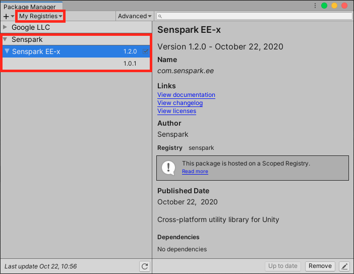

# Getting Started
## Requirements
- Unity 2020.1+: <https://unity3d.com/get-unity/download>
- Android SDK: 17+
- iOS SDK: 12.0+

## Configuration
### Prerequisite
- External Dependency Manager: <https://github.com/googlesamples/unity-jar-resolver>
- Add the following packages to [link.xml](https://docs.unity3d.com/Manual/ManagedCodeStripping.html#LinkXML)
```xml
<linker>
    <assembly fullname="Firebase.Analytics">
    </assembly>
    <assembly fullname="Firebase.App">
    </assembly>
    <assembly fullname="Firebase.Crashlytics">
    </assembly>
    <assembly fullname="Firebase.RemoteConfig">
    </assembly>
    <assembly fullname="Newtonsoft.Json">
    </assembly>
</linker>
```

### Installation
- Add the **Senspark** to your Unity project
    - If you use Unity 2019.4.12+ then go to **Edit/Project Settings/Package Manager** and add **Senspark** scoped registry
    

    - Else you can also manually add the following block to **Packages/manifest.json**

            "scopedRegistries": [
              {
                "name": "Senspark",
                "url": "https://registry.npmjs.org",
                "scopes": [
                  "com.senspark"
                ]
              }
            ]
            

- Go to **Window/Package Manager** and install **Senspark EE-x** package in **My Registries** packages


- Go to **Assets/Senspark EE-x/Settings** to customize plugin settings

## Initialization
```csharp
public class TestScene : MonoBehavior {
    private void Awake() {
        // Call this method only once.
        EE.PluginManager.InitializePlugins();
    }
}
```
