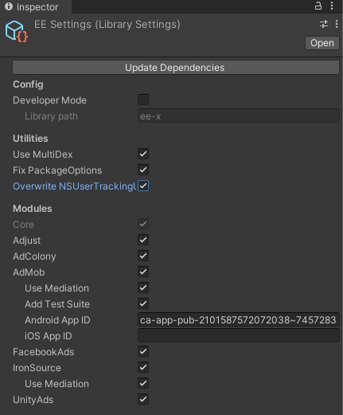

# Getting Started
## Configuration
Prerequisite:

- External Dependency Manager: <https://github.com/googlesamples/unity-jar-resolver>

Installation:

- Go to **Edit/Project Settings/Package Manager** and add **Senspark** scoped registry


- Go to **Window/Package Manager** and install **Senspark EE-x** package in **My Registries** packages


- Go to **Assets/Senspark EE-x/Settings** to customize plugin settings

## Initialization
```csharp
public class TestScene : MonoBehavior {
    private void Awake() {
        EE.PluginManager.InitializePlugins();
    }
}
```
